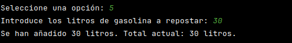
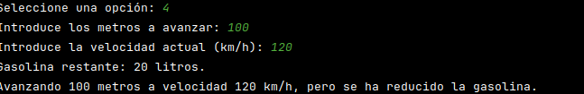
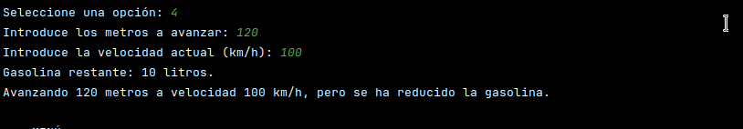
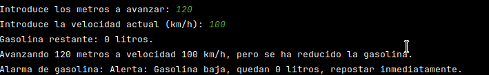
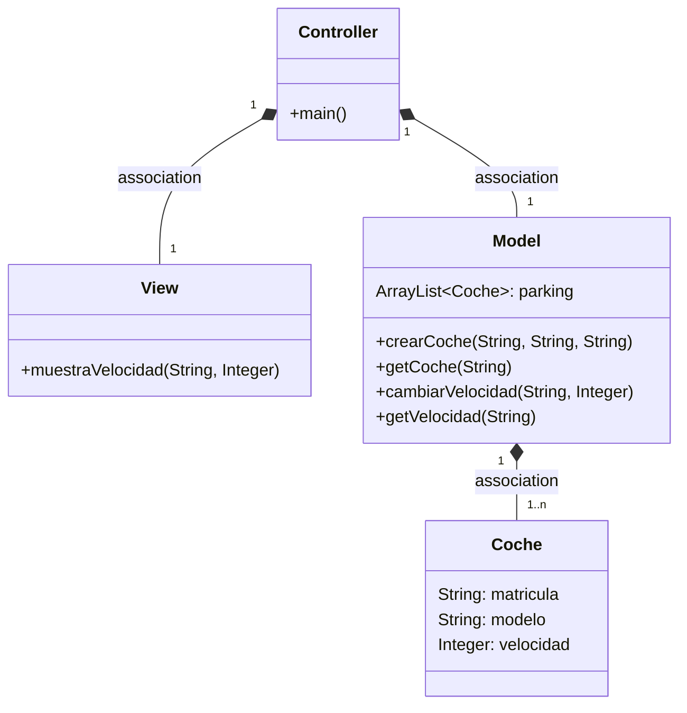
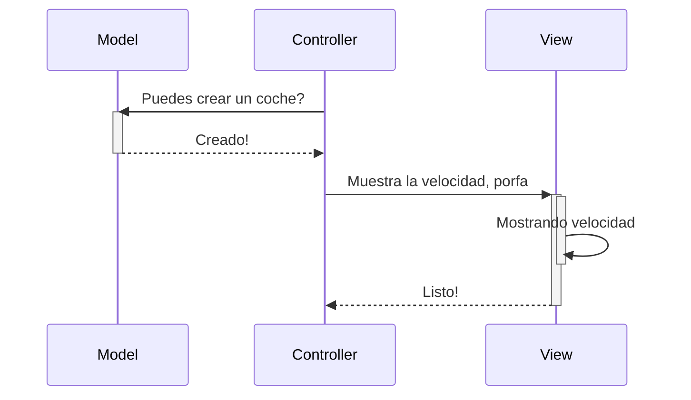
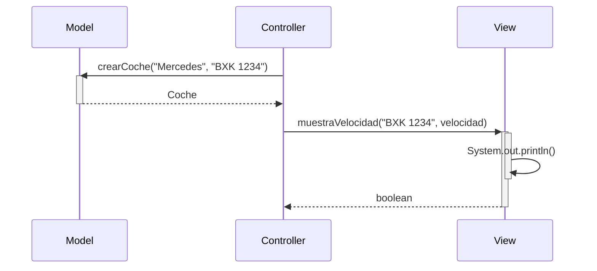
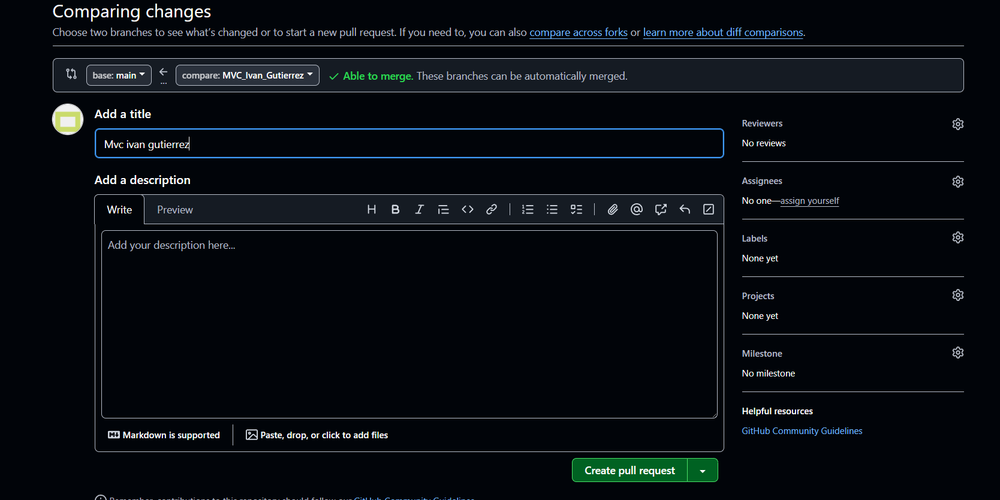
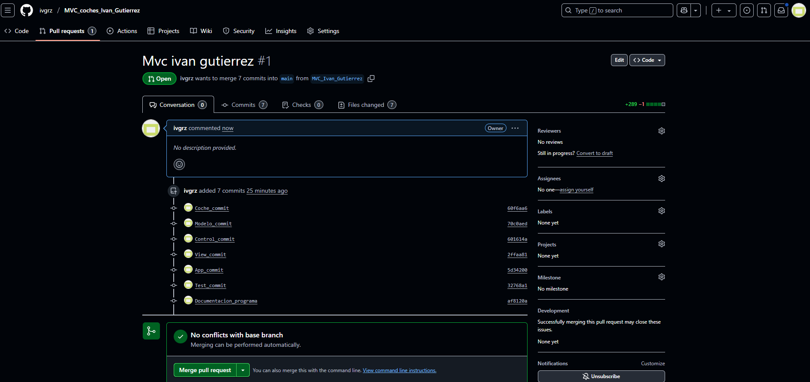
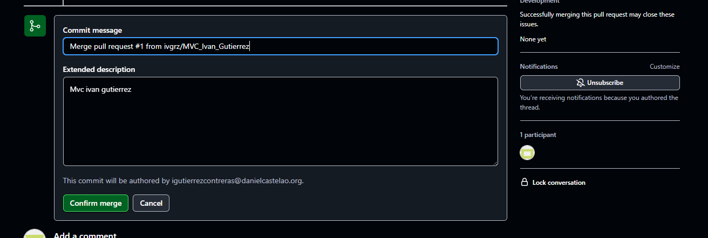

# Funciones:
- Las funciones del programa son Avanzar() y Poner Gasolina().
- A diferencia del diagrama de flujo, este programa agrego una funcion *reducirGasolina* para disminuir la cantidad de gasolina, de
acuerdo a los metros recorridos y la velocidad del coche.

- La funcion poner Gasolina, recibe como parametro la cantidad de gasolina a agregar, la actualizacion de la cantidad de gasolina que hay
y la cantidad de gasolina que ya posee el coche.

- Realice el JavaDoc

# Observer:
- Se usa el interface Observer para que se notifique el cambio en el deposito de gasolina del coche.
- El interface Observer tiene un metodo llamado actualizar gasolina
- La clase AlarmGasolina implementa el interface Observer y se encarga de mostrar un mensaje cuando la gasolina del coche es menor a 10 litros.
- Esta clase se implementa en el metodo avanzar del coche, donde se verifica si la cantidad de gasolina es menor a 10 litros y se notifica al observer.
- La clase Coche tiene un ArrayList de observers, donde se agregan los observers que se quieren notificar.

# Comprobacion de la funcionalidad:

# Arquitectura MVC

Aplicación que trabaja con objetos coches, modifica la velocidad y la muestra

---
## Diagrama de clases:

---

## Diagrama de Secuencia

Ejemplo básico del procedimiento, sin utilizar los nombres de los métodos

El mismo diagrama con los nombres de los métodos

# Funciones del programa:

# Model

crearCoche(String modelo, String matricula) Crea un nuevo coche con el modelo y matrícula especificados y lo agrega al parking.  

getCoche(String matricula) Devuelve el coche correspondiente a la matrícula proporcionada. Si no existe, lanza una excepción.  

cambiarVelocidad(String matricula, Integer nuevaVelocidad) Cambia la velocidad del coche identificado por la matrícula. Si el coche no existe, lanza una excepción.  

getVelocidad(String matricula) Devuelve la velocidad actual del coche identificado por la matrícula.  

getTodosLosCoches() Devuelve una lista con todos los coches registrados en el parking.

# View

muestraVelocidad(String matricula, Integer v) Muestra en la consola la velocidad actual de un coche en el formato: matricula: velocidad km/hr.  

mostrarTodosLosCoches(ArrayList<Coche> coches) Muestra en la consola una lista de todos los coches registrados. Si no hay coches, indica que no hay registros.  

menu() Muestra un menú interactivo en la consola para que el usuario pueda realizar las siguientes acciones:  

Crear un coche.

Aumentar o disminuir la velocidad de un coche.

Mostrar todos los coches registrados.

Salir del programa.

# Controller

aumentarVelocidad(String matricula, Integer nuevaVelocidad) Incrementa la velocidad de un coche identificado por la matrícula.  

disminuirVelocidad(String matricula, Integer nuevaVelocidad) Disminuye la velocidad de un coche identificado por la matrícula.

# App
Esta clase muestra la interacción entre el modelo, la vista y el controlador.

Es donde el usuario puede interactuar con el programa a través de un menú.

### Código de `App`

    public class App {
    public static void main(String[] args) {
        // Crear instancias del Model y Controller
        Model miModel = new Model();
        Controller miController = new Controller();

        // Crear la View y pasarle el Controller
        View miView = new View();

        // Iniciar el menú
        miView.menu();
    }

# Pull request y merge

}